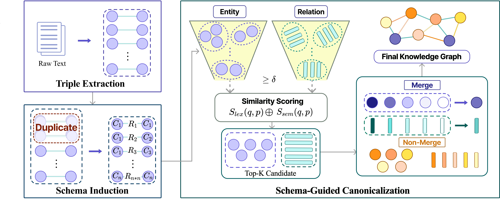

# Less Is More: Knowledge Graph Construction and Schema-Guided Canonicalization with LLMs

Official implementation of **"Less Is More: Knowledge Graph Construction and Schema-Guided Canonicalization with LLMs"**.

## Paper Figure (Overview)

Add the main figure image at:

- `assets/less_is_more_kg_overview.png`

Then it will render here:



## Quick Start

From the project root (`/home/less-is-more-kg`):

```bash
# (Recommended) create env
conda create -n lessmorekg python=3.10.12
conda activate lessmorekg

# install dependencies
pip install -r requirements.txt
```

After installing requirements, run each pipeline by reading the README in its folder:

- **Construction (extract)**: see `construction/README.md`
- **Canonicalization (normalize triples)**: see `canonicalization/README.md`
- **Evaluation (Metrix)**: see `evaluate/README.md`

## Pipelines

### Construction

- **What it does**: Extract triples from articles them.
- **How to run**: follow `construction/README.md`

### Canonicalization

- **What it does**: Canonicalize (normalize/merge) entity/relation surface forms from row-wise triples.
- **How to run**: follow `canonicalization/README.md`

### Evaluation

- **What it does**: Run Metrix metrics (G-BLEU / G-ROUGE / G-BERTScore) against golden triples.
- **How to run**: follow `evaluate/README.md`
